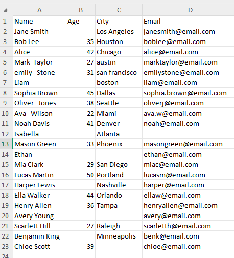

# 🧹 Python Automation: Data Cleanup Tool

## 🧠 About This Project
Hi! I’m **Babalola**, a beginner Python developer passionate about automating everyday tasks for individuals and businesses.

This project is a **simple yet powerful script** that cleans messy CSV or Excel files by:
- Removing blank rows  
- Stripping extra spaces  
- Standardizing column headers  
- Saving the cleaned version automatically  

It’s great for anyone who works with exported data from Excel, web apps, or CRMs and wants to tidy it up instantly with Python.

---

## ⚙️ Features
✅ Removes completely empty rows  
✅ Trims extra spaces in text fields  
✅ Standardizes column names (title case)  
✅ Works with CSV files (Excel support coming soon)  
✅ Easy to customize for your workflow  

---

## 🧹 Before and After Cleaning

Below are examples showing how the data looks before and after using `data_cleaner.py`:

### 🪞 Before Cleaning


### ✨ After Cleaning


## 🚀 How It Works

1. Place your raw file (e.g., `uncleaned_data.csv`) in the same folder as the script  
2. Run the script using:

```bash
python data_cleaner.py
